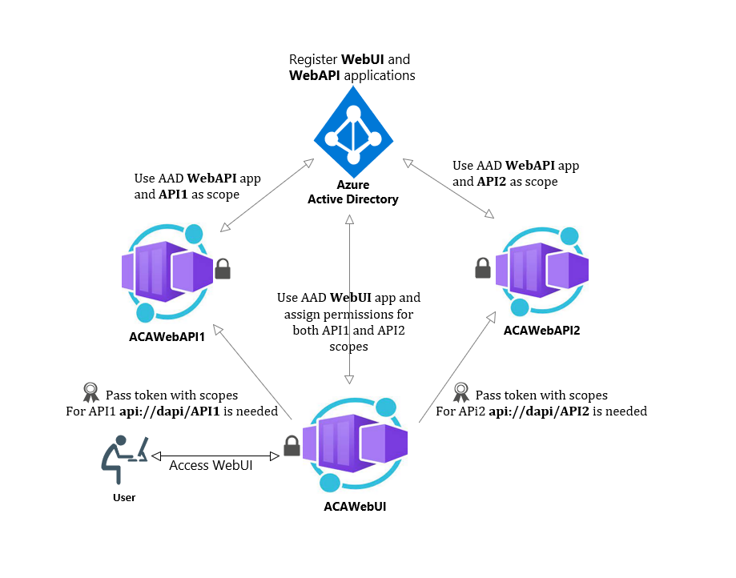

# Using Multiple Scopes in AAD to authorize requests between different APIs hosted on Azure Container Apps 

This repository contains code for a sample application to implement the following scenario:

- The frond-end application, **WebUI** that authenticate user from Azure Active Directory using OAuth 2.0 Authorization Code Grant flow.
   
- Two backend services namely **WebAPI1** and **WebAPI2** that authorizes request based on the scopes passed by the WebUI in Access token generated by Azure Active Directory. 

## Architecture 

This is the high-level design of the solution. The applications are hosted on Azure Container Apps, and they utilize Azure Active Directory to perform authentication and authorization via the OAuth 2.0 Authorization Code Grant flow.

## Configure Project

Run the following steps to configure this on to your AAD tenant: 

- Register one application as **WebUI** in Azure AD
- Register one application as **WebAPI** in Azure AD and define two scopes as **API1** and **API2**
- Update **Client Id**, **Client Secret** and **Tenant Id** in the **appsettings.json** of **WebUI** project. Also update the **BaseUrl** and **Scopes** for API1 and API2. 
- Update **Client Id**, **Tenant Id**, **Audience** as the Scope set for WebAPI in AAD for both **WebAPI1** and **WebAPI2** projects.
- Update scopes as **API1** for **WebAPI1** project and **API2** for **WebAPI2** project. 
- Build docker containers and deploy on ACA (Azure Container Apps) using the scripts provided in the **Scripts** folder.

Hope this helps!